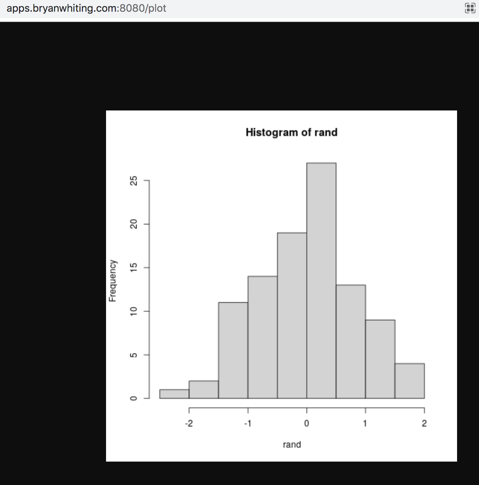

<!-- README.md is generated from README.Rmd. Please edit that file -->

```{r, include = FALSE}
knitr::opts_chunk$set(
  collapse = TRUE,
  message=F,
  comment = "#  "
)
```

# Create a Database from CSV

Create a database (loaded from CSV):

```{r}
library(DBI)
con <- dbConnect(RSQLite::SQLite(), db=here::here('data-raw/data.db'))
df <- readr::read_csv(here::here("data-raw/data.csv"))
dbWriteTable(con, 'test', df, overwrite=T)
dbDisconnect(con)
```

# Read from Database

```{r}
con <- dbConnect(RSQLite::SQLite(), db=here::here('data-raw/data.db'))
res <- dbSendQuery(con, "SELECT * FROM test")
dbFetch(res)
```


# Sample Data (SQL)

```{sql, connection = con}
select *
from test 
```

# SQL approach

```{sql, connection = con}
with t1 as (
  select *,
  case when p = "sub" or INSTR(s, ".") = 0 then s
      else substr(s, 1, INSTR(s, ".") - 1)
      end as s_clean,
    RANK() OVER(partition by 
      case when p = "sub" or INSTR(s, ".") = 0 then s
      else substr(s, 1, INSTR(s, ".") - 1)
      end
      order by t) as r
  from test
  where (s LIKE "s1%" OR s LIKE "s2%")
  AND s not in (
    select distinct s
    from test 
    where p = "sub"
  )
)
select s, s_clean,
  max(case when p = 'h' then v end) as h,
  max(case when p = 'w' then v end) as w,
  max(case when p = 'a' then v end) as a
from t1
where s in (select distinct(s) from t1 where r = 1)
group by 1, 2
```

# R

```{r}
library(readr)
library(dplyr)
library(tidyr)
library(stringr)
res <- dbSendQuery(con, "SELECT * FROM test")
df <- dbFetch(res) 

keep = c('s1', "s2")

df %>%
  filter(str_detect(s, paste(keep, collapse="|"))) %>%
  mutate(
    x = str_extract(s, "\\w[0-9]*"),
    s_clean = ifelse(is.na(x), s, x)
   ) %>%
  filter(!(s %in% (df %>% filter(p == "sub") %>% distinct(s)))) %>%
  group_by(s_clean) %>%
  mutate(keep_s = row_number() == 1) %>%
  group_by(s) %>%
  filter(max(keep_s) == TRUE) %>%
  select(s, s_clean, p, v) %>%
  pivot_wider(names_from=p, values_from=v) %>%
  DT::datatable()
```


# Building an App and API

To make a full-stack solution to this problem, it'd be best for the end
user to either have access to a web app (user-friend) or an API (for backend systems).
I built both and left details steps on how to replicate my work (see [README](https://github.com/bryanwhiting/sqlite_test). A demo and summary is below.

## Overview

* App is hosted at [apps.bryanwhiting.com](apps.bryanwhiting.com)
* API is hosted at apps.bryanwhiting.com:8080/ with endpoints [apps.bryanwhiting.com:8080/inspect](apps.bryanwhiting.com:8080/inspect) for data inspection and [apps.bryanwhiting.com:8080/plot](apps.bryanwhiting.com:8080/plot)
for plots.


## App

I built a web app available at [apps.bryanwhiting.com](apps.bryanwhiting.com).

The goal of this app is to make it easy for users to search their serial numbers
and get back clean data (the same processing done above in this example).

### Data Inspection

On the landing page, the dash shows all the raw data.


The dash lets you transform your data:


And it also lets you use `selectize` multiple selection to filter to 
seria numbers you care about:


### Charts

On the `Charts` tab, users can see trends in the data. They can 
interact with those charts to identify anomalies.


## App Tech Stack

Code for the [app](https://github.com/bryanwhiting/sqlite_test/tree/main/app), [Dockerfile]](https://github.com/bryanwhiting/sqlite_test/tree/main/Dockerfile).

* Built a docker image on my mac for prototyping
* Used [R Shiny](https://shiny.rstudio.com/) as my interactive web app
* Used [argonDash](https://rinterface.github.io/argonDash/) theming on top
of `shiny` to get a beautiful UI out of the box.
* Pushed docker image to dockerhub [bryanwhiting/argonapp](https://hub.docker.com/repository/docker/bryanwhiting/argonapp)
* Launched EC2 instance with appropriate ports exposed (80, 443, and 8080 for the API)
* SSH'd into the EC2, installed command-line tools, and pulled my docker container
* Cloned this repo: https://github.com/bryanwhiting/sqlite_test, which had my 
app
* Ran my docker container, mounting my app, and exposing the ports so they can
be viewed globally
* Created a personal DNS on my private website: `apps.bryanwhiting.com`
* Used Route53 to forward my EC2's ip address to my personal DNS.

## API

Code for the [API](https://github.com/bryanwhiting/sqlite_test/tree/main/api), [Dockerfile]](https://github.com/bryanwhiting/sqlite_test/tree/main/api/Dockerfile).

Prior to this experience, I had never built an API. I researched how to 
build an API in R, and came across the [`plumber`](https://www.rplumber.io/) package. I ventured to replicate the App's functionality, but as an API.

### Curling my API on the Terminal

The API is accessible via `apps.bryanwhiting.com:8080/inspect`. Calling
just `/inspect` will return the full dataset in json. If you want to filter
to a specific serial number, call `/inspect?serials=s1`, or `/inspect?serials=s2`.
To call multiple, use a pipe: e.g., `s1|s4` (the pipe is `%7C`), or `/inspect?serials=s1%7Cs2`.


If you enter a bad serial number, you'll get a helpful error:


### Getting my API on the Browser

Accessing the API via the web, you get this:


### `/plot` endpoint from the API

The API can also generate plots: apps.bryanwhiting.com:8080/plot



This plot just generates random data every time you call it, but it could
easily generate valuable insights about the serial numbers.

## API Tech Stack

* [`plumber`](https://www.rplumber.io/) as the API, inspired by Python's `flask`
* Created docker container [bryanwhiting/plumber](https://hub.docker.com/repository/docker/bryanwhiting/plumber)
* Launched container on same AWS instance, exposing to port 8080.

# Future Ideas with More Time

With more time, I would do the following:

App: 

* To the app, add ML-driven, time-series anomaly detection
* Add user-login to the app
* Have automated, user-specific notifications in the user's profile
* Add auto-emailing using [`blastula`](https://github.com/rstudio/blastula) when
anomalies arise
* Scale the app on ECS so it can be more reliable

Code:

* Package the data-processing code and add unit tests
* Add CI/CD checks (security, linting, etc.) using GitHub Actions
